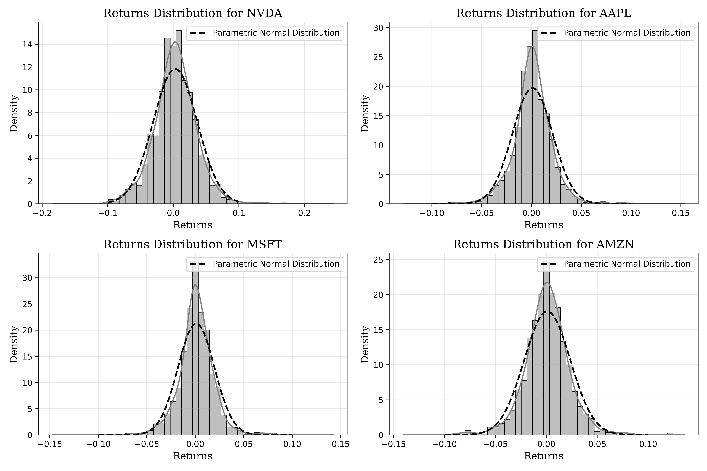

# Computing the Value at Risk (VaR) of a Portfolio

Yvan Richard  
yvan.richard2004@gmail.com   
*Fall 2025*

## Introduction 

In this small sub-project, we will load financial data from Yahoo Finance with
the Python API `yfinance` and build a VaR function to compute the VaR of this
portfolio. Our portfolio will be built out of four different securities, namely
equities. In particular the *heavier* stocks in the S&P 500 index:

- Nvidia Corp. : `NVDA`
- Apple Inc. : `AAPL`
- Microsoft: `MSFT`
- Amazon: `AMZN`

It is an interesting experiment to do since these four stocks account for roughly $25\%$ of the index (as of today's date: 7 Nov. 2025).

The weights $w_i$ associated to these stocks are given by (same relative weights between themselves as in the index):

$$
\mathbf{w}^T = \{ 0.301, 0.27, 0.251, 0.178\}
$$

where $\sum_{w \in \mathbf{w}} w = 1$. To proceed, we will be using **historical data from 01.01.2020 to 06.11.2025**. 

## Computing the VaR of a Portfolio

### Portfolio $P$ Daily Returns

To compute the VaR of a portfolio $P$, composed of $n = 4$ stocks with weight $w_i$,
we first compute the daily return (at time $t$) of P from the data:

$$
r_{P, t} = \mathbf{w}^T\mathbf{r_t}
$$

where $\mathbf{r_t}$ is the vector containing the daily returns at time $t$ of the respective stocks:

$$
\mathbf{r_t} = 
\begin{bmatrix}
    r_{1, t} \\
    r_{2, t} \\
    r_{3, t} \\
    r_{4, t} \\
\end{bmatrix}
$$

In our practical case, we have the matrix $R$, which is represented by:

$$
R =
\begin{bmatrix}
    \ldots && \mathbf{r_t}^T &&  \ldots \\
    \ldots && \mathbf{r_{t + 1}}^T &&  \ldots \\
     && \vdots \\
    \ldots && \mathbf{r_T}^T &&  \ldots \\
\end{bmatrix}
$$

So we compute the daily returns of the portfolio over the period $(t, T)$ as:

$$
\mathbf{r}_P = R\mathbf{w}
$$

### The Normality Assumption


We now make a **parametric (Gaussian) assumption**: the daily portfolio returns $r_{P,t}$ are i.i.d. and approximately normal,
$$
r_{P,t} \sim \mathcal{N}(\mu_P,\,\sigma_P^2),
$$
so that risk can be summarized by the mean $\mu_P$ and standard deviation $\sigma_P$. Under this assumption, the 1‑day **parametric VaR** at tail level $\alpha\in(0,1)$ for a portfolio with value $V$ is
$$
\mathrm{VaR}_\alpha^{\text{Gauss}} \;=\; -\,Q_\alpha(\Delta P) \;\approx\; V\,\Big(-\mu_P - z_\alpha\,\sigma_P\Big),
$$
where $Q_\alpha$ is the $\alpha$-quantile of P\&L and $z_\alpha$ is the $\alpha$-quantile of the standard normal (e.g., $z_{0.01}\!\approx\!-2.326$).

> **Sign convention.** VaR is reported as a positive loss number: there is probability $\alpha$ that the loss over the horizon exceeds $\mathrm{VaR}_\alpha$.

**Caveats.** The normality/i.i.d. assumption is strong. In equity data we often see:
- **Fat tails (excess kurtosis)** and **skewness** $\Rightarrow$ Gaussian VaR tends to **underestimate tail risk**.
- **Volatility clustering** (time‑varying $\sigma_t$) and **serial dependence** $\Rightarrow$ $\sqrt{h}$ scaling can be misleading.

## Results

After having processed our data both in Python and C++, we find the following output:

``` cpp
Data imported successfully. Rows: 1468, Columns: 4
Portfolio Mean Daily Return: 0.00135571
Portfolio Daily Standard Deviation: 0.0194869
Value at Risk (VaR) at 99% confidence level: 0.0439776
```

This means that over one trading day, if all our above assumption holds, we have $1$ in $100$ chances that our portfolio composed of the S&P 500 heavy weights loses more than
$4.40\%$ of its total value.

## Limitations 

While the Gaussian one-day VaR provides a convenient analytical benchmark, its interpretation must be treated with caution. The model assumes that daily portfolio returns are independent and identically distributed and follow a normal law, allowing tail losses to be inferred from the estimated mean and variance. In practice, equity returns display fat tails, skewness, and volatility clustering, which cause the normal model to underestimate extreme losses and make the usual $\sqrt{h}$ time-scaling unreliable for multi-day horizons. Moreover, the chosen 99 % confidence level lies far beyond the empirical support of a five-year sample (≈1,500 observations), so the **result relies on distributional extrapolation rather than observed data**. Finally, fixed portfolio weights ignore rebalancing effects and changing market composition. For these reasons, the computed VaR should be viewed as a simplified, parametric approximation of tail risk rather than a statistically validated capital measure. Below is a plot displaying the empirical distribution of the daily returns overlayed by a parametric
normal distribution.



However, the purpose of this mini-project was just to play around with some integrations between API, notebooks, and C++ code as well as the Boost libraries.


---
# END